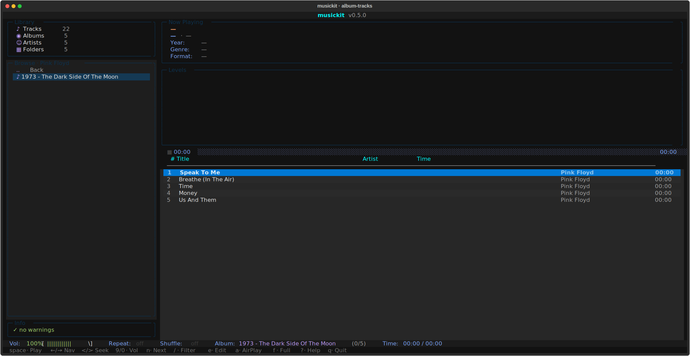

# musickit

Python 3.13 CLI for converting audio rips into a clean tagged library, browsing and playing it via a Textual TUI, and streaming it over Tailscale via a Subsonic-compatible HTTP server.

[](https://github.com/winterop-com/musickit/actions/workflows/ci.yml)
[](https://pypi.org/project/musickit/)
[](https://www.python.org/downloads/)
[](LICENSE)
[](https://winterop-com.github.io/musickit/)

## Install

The lowest-friction way is [`uvx`](https://docs.astral.sh/uv/) — it downloads, caches, and runs the latest published `musickit` in one step. No install step required:

```bash
uvx musickit --help
```

For daily / persistent use (PATH-installed, no per-run network check):

```bash
uv tool install musickit
musickit --help
```

You'll also need `ffmpeg` and `ffprobe` on `$PATH` for the convert pipeline:

```bash
brew install ffmpeg            # macOS
sudo apt install ffmpeg        # Debian / Ubuntu
```

## Quickstart

```bash
uvx musickit convert ./input ./output       # convert
uvx musickit library audit ./output         # audit
uvx musickit tui ./output                   # TUI
uvx musickit serve ./output                 # Subsonic server
```

## Screenshots

The TUI: artist browser on the left, drilled into an album, 48-band visualizer at the top.



Fullscreen visualizer (`f`):


More screenshots in the [TUI guide](https://winterop-com.github.io/musickit/guides/tui/).

## Documentation

Full docs are at **[docs/](docs/index.md)** — built with MkDocs Material. Run them locally:

```bash
make docs-serve     # http://127.0.0.1:8000
```

Or jump straight to:

- [Architecture](docs/architecture.md) — how all the pieces fit together (process model, data flow, audio subprocess, SQLite index, FFT visualizer)
- [Tutorial: 0 to iPhone streaming](docs/guides/tutorial.md) — end-to-end walkthrough including Tailscale + Amperfy
- [Quickstart](docs/guides/quickstart.md) — install + first convert
- [musickit convert](docs/guides/convert.md) — codec / bitrate / enrichment matrix
- [musickit library](docs/guides/library.md) — audit rules + auto-fix + SQLite index
- [musickit tui](docs/guides/tui.md) — TUI: local + radio + Subsonic-client + AirPlay
- [musickit serve](docs/guides/serve.md) — Subsonic API + Tailscale + clients
- [Edge cases](docs/edge-cases.md) — every weirdness encountered on real rips
- [Roadmap](docs/roadmap.md) — what's next
- [Development](docs/guides/development.md) — directory layout + test patterns + commit style

## Status

v0.4.1 · ruff + mypy + pyright clean, full pytest suite green. Five top-level commands — `convert`, `library`, `inspect`, `tui`, `serve` — with `library` carrying the read / mutate / manage subcommands (`tree`, `audit`, `fix`, `cover`, `cover-pick`, `retag`, `index`). The TUI ships local-library playback, internet radio, Subsonic-client mode, AirPlay output (incl. pause + volume routing), mDNS discovery, ReplayGain normalisation, an incremental `/`-filter, in-place tag editing (`e` for track / album-wide), a 48-band FFT visualiser, and click-to-seek on the progress bar. Audio decoder + sounddevice callback run in a separate process so UI work in the main interpreter can't stall playback. The server is OpenSubsonic-compatible (`multipleGenres`, `transcodeOffset`, `songLyrics` extensions) and tested against Symfonium / Amperfy / play:Sub / Feishin clients on iOS / Android / desktop. A persistent SQLite library index at `<root>/.musickit/index.db` makes cold starts skip the filesystem walk + tag read; the filesystem watcher does per-album incremental rescans.

## License

See LICENSE in the repo root.
