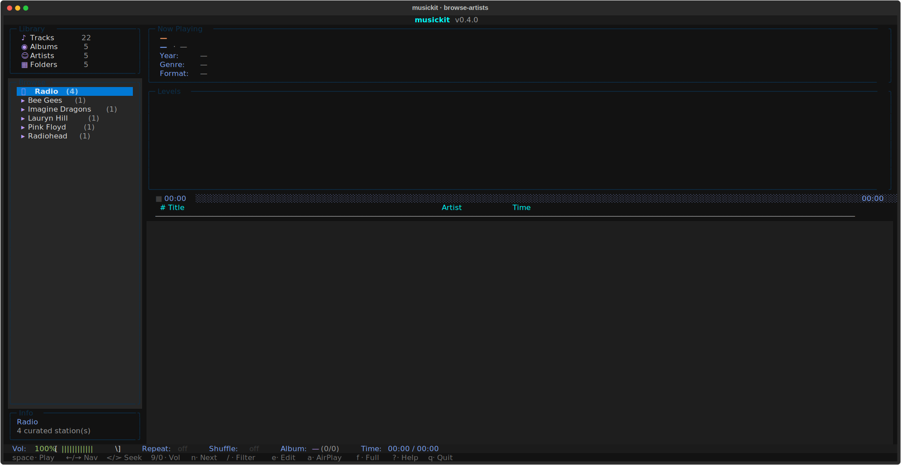
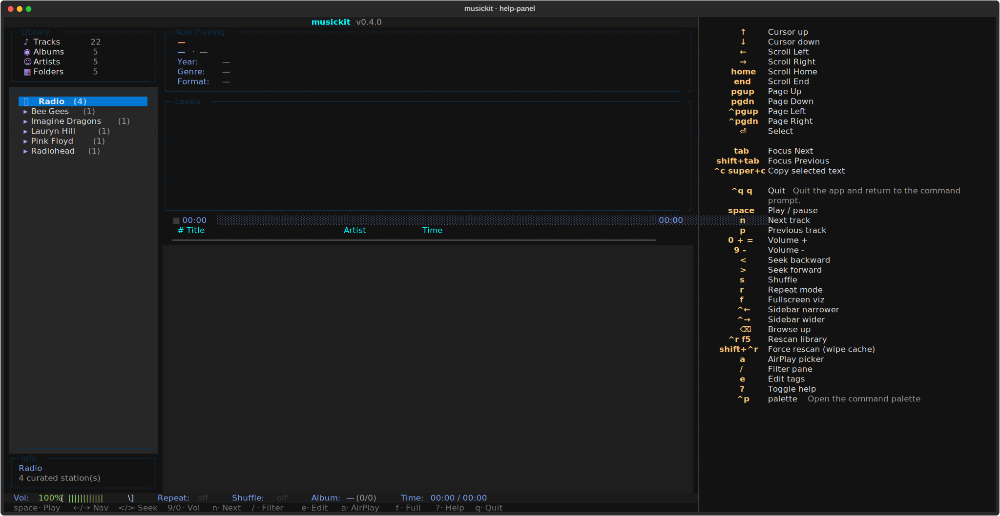
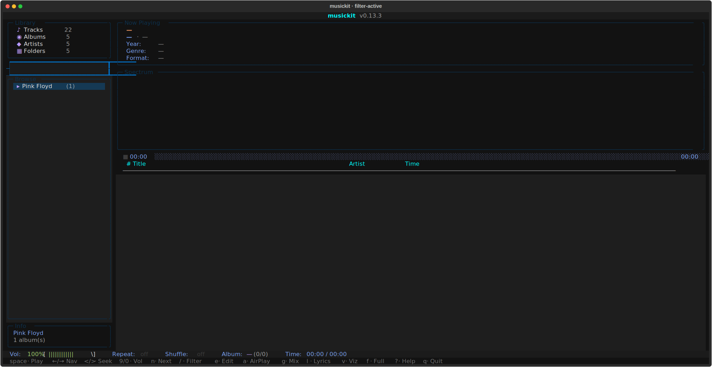

# `musickit tui`

A Textual TUI for browsing + playing the converted library, plus a curated radio section, plus a Subsonic-client mode for connecting to a remote `musickit serve` (or any Subsonic server) over Tailscale.

## Modes

```bash
uvx musickit tui ./output                                # local library + radio
uvx musickit tui                                         # radio-only
uvx musickit tui --subsonic URL --user U --password P    # Subsonic client mode
uvx musickit tui --discover                              # list LAN Subsonic servers + AirPlay devices, exit
uvx musickit tui --airplay 'HomePod'                     # route playback to an AirPlay device
uvx musickit tui ./output --no-cache                     # skip the index DB (in-memory scan only)
uvx musickit tui ./output --full-rescan                  # rebuild the index DB from scratch on launch
```

Subsonic credentials are NEVER persisted — pass `--subsonic` / `--user` / `--password` explicitly each session. With no arguments the TUI drops directly into radio-only mode.

Local-library mode reuses the persistent SQLite index at `<DIR>/.musickit/index.db` so the second launch skips the filesystem walk and tag read. See [`musickit library index`](library.md#index-manage-the-persistent-sqlite-cache) for management commands and details.

## Layout

Initial browse view (artist list):



Drilled into an album, tracklist on the right:


Fullscreen visualizer (`f`):


- **Top**: now-playing meta, 48-band FFT visualizer (FFT runs in the audio engine subprocess and is published to the UI via shared memory — see [Architecture](../architecture.md#the-visualizer-fft-path) for the full FFT pipeline), progress with state icon + click-to-seek.
- **Sidebar**: library stats + Artist→Album browser. Cursor on an album row previews its tracks immediately on the right.
- **Main**: track list with `▶` marker on the playing row.
- **Bottom**: status bar + keybar (most-used shortcuts) + ?-help panel for the full binding list.

## Keybindings

| Key | Action |
|---|---|
| `↑` / `↓` / `j` / `k` | Navigate within the focused pane |
| `Enter` | Play selected track / drill into selected album / connect to selected radio station |
| `Space` | Play / pause |
| `n` / `p` | Next / previous track |
| `<` / `>` | Seek -5s / +5s |
| `9` / `0` | Volume down / up (mpv-style; `+` / `-` also work) |
| `s` | Toggle shuffle |
| `r` | Cycle repeat (off → album → track) |
| `f` | Toggle fullscreen visualizer |
| `v` | Show / hide visualizer panel (frees space for the tracklist) |
| `g` | Generate a 60-min mix anchored to the highlighted track |
| `/` | Filter the focused pane (artists / albums / tracks) |
| `e` | Edit tags — track-level on track list, album-wide on album row |
| `Tab` | Cycle focus across browser / track list |
| `Backspace` | Browser: go up one level |
| `Ctrl+R` / `F5` | Rescan library (delta-validate against filesystem) |
| `Ctrl+Shift+R` | Force rescan (wipe SQLite cache + rebuild) |
| `?` | Toggle full-keybindings help panel |
| `Ctrl+P` | Command palette (also surfaces playback verbs) |
| `a` | AirPlay device picker |
| `q` / `Ctrl+C` | Quit |

Click semantics on the track list mirror Spotify / iTunes: single click moves the cursor only (no playback), double click within ~400ms plays the track. Click anywhere on the progress bar to seek to that position.

`?` opens the full HelpPanel with every binding:



`/` opens an inline filter that narrows the focused pane to a case-insensitive substring match — useful for jumping to an artist on a 1000+ album library:



## Local library mode

`musickit tui ./output` hydrates the persistent SQLite index at `<DIR>/.musickit/index.db` if present (a delta-validate pass picks up filesystem changes since the last run); otherwise it walks the directory via `library.scan` + `library.audit`. Initial scan shows a centred progress overlay with album-by-album feedback; subsequent rescans (`Ctrl+R`) re-validate against the filesystem.

### Audio engine architecture

PyAV decoder + sounddevice output run in a **separate process**, spawned at startup. The UI process (Textual) and the audio engine each have their own Python interpreter, their own GIL. This means heavy UI work — Textual reflows on resize, focus changes between panes, GC pauses — can't stall the audio callback into a buffer underrun (the cause of the audible clicks the project chased through several earlier mitigations: 500ms then 1s PortAudio buffer, resize-debounce, focus-change short-circuit).

Communication:

- **`multiprocessing.Queue` × 2** — UI → engine commands (play / pause / seek / stop / shutdown), engine → UI events (track_end, track_failed, metadata_changed, started). Pickled dataclasses; one reader thread on the UI side dispatches events to registered callbacks.
- **`multiprocessing.Value` / `Array`** — high-frequency shared state (position frames, paused/stopped flags, volume, replaygain multiplier, 48 band levels). Atomic per-slot reads/writes; the visualizer reads bands directly without round-tripping through the queue.

Inside the audio engine:

- **Opener thread** per `play()` — does the slow part of starting playback (`av.open` for HTTP streams = HTTP connect = 1+ second). The previous track keeps playing during the connect, so station switches don't have an audible silence-and-pop.
- **Decoder thread** per playback — reads packets, decodes, resamples, pushes float32 stereo chunks into a bounded queue (~12s buffer).
- **Audio callback** (sounddevice-managed) — drains chunks across `frames` boundaries with carry state, so `frames != _CHUNK_FRAMES` doesn't drop or pad samples. Also runs the FFT for the visualizer and publishes the 48 band levels into shared memory.
- **Pre-buffer** — wait for ~186ms of audio before starting the output stream. Without this the first 1-2 callbacks see an empty queue and the user hears "silence-then-pop" attacks.

PortAudio buffer latency is 200ms — small enough that the visualizer (which FFTs the chunk being sent to PortAudio) doesn't run noticeably ahead of what the user hears, and large enough to absorb decoder hiccups inside the engine process.

## Internet radio

When you select the **Radio** entry in the sidebar, the right pane shows a curated list of stations. Default ones are baked into the code (NRK mP3 / P3 / P3 Musikk / Nyheter); you can add your own via `~/.config/musickit/radio.toml`:

```toml
[[stations]]
name = "BBC Radio 6 Music"
url = "https://stream.live.vc.bbcmedia.co.uk/bbc_6music"
description = "BBC's alternative music station"
homepage = "https://www.bbc.co.uk/6music"
```

Defaults baked into code + user TOML are merged at runtime (deduped by URL, user entries win on collision). So the default list only grows when we ship new entries; your file only grows when you add them by hand.

ICY metadata polling: while a stream is playing, the decoder thread polls `container.metadata` per packet for `StreamTitle` updates. The "now playing" pane updates with the live song name as the radio station broadcasts it.

Radio launches as a first-class mode — `musickit tui` with no DIR drops directly into station picking (skipping the library scan entirely).

## Mixes — auto-generated playlists

Press `g` on a TrackList row to generate a 60-min mix anchored to that track. The action:

1. Resolves the seed (highlighted row, falls back to currently-playing track).
2. Calls `playlist.generate(index, seed, target_minutes=60)` — same builder as the [`musickit playlist gen`](playlist.md) CLI.
3. Persists the result to `<root>/.musickit/playlists/<slug>.m3u8` for cross-tool reuse (VLC, Subsonic clients).
4. Wraps the result as a virtual `LibraryAlbum` (`artist_dir = "Mix"`) and starts playback. Next / prev / shuffle / repeat all work on the mix as if it were a regular album.

Saved mixes are browseable: select **Mixes** in the sidebar (sits next to **Radio**) and the right pane shows one row per `.m3u8` under `<root>/.musickit/playlists/`. Enter on a row replays it. Tracks whose paths no longer resolve are silently skipped, so a saved mix degrades gracefully if you've reorganised the library since.

The on-disk format is the standard extended M3U with `#EXTINF` lines — every audio player understands it. See the [playlist guide](playlist.md) for the similarity scoring details and CLI surface.

## Subsonic-client mode

`musickit tui --subsonic URL` makes the TUI talk to any Subsonic-compatible server — your own `musickit serve` over Tailscale, Navidrome, the original Subsonic, etc.

```bash
uvx musickit tui --subsonic http://mlaptop.tail4a4b9a.ts.net:4533 \
             --user mort --password secret
```

Credentials are not persisted — pass `--subsonic` / `--user` / `--password` every time you want client mode.

How it works:

- Launch: 1 (`getArtists`) + N (`getArtist` per artist) calls; ~80 calls for a 800-album library, sub-second over Tailscale. Albums come back as **shells** (metadata + `subsonic_id`, `tracks=[]`).
- Click an album: a `@work(thread=True)` hydrate worker fires `getAlbum?id=...` in the background; the tracklist shows `Loading tracks…` until the response arrives. Hydrated tracks are cached for the rest of the session, so re-opening an album is instant.
- Playback: `track.stream_url` carries the auth-loaded `/rest/stream` URL; `AudioPlayer.play()` hands it straight to PyAV (no different from a radio URL).

Same widgets, same keybindings, same UX as local mode. The only differences are the brief loading delay on first open of each album, and the lack of a local file path (track files exist remotely on the server's disk).

## AirPlay output

Press `a` in the TUI to open the AirPlay picker. It scans the LAN via mDNS, lists discovered devices (HomePods, AirPort Express, Sonos in AirPlay-2 mode, etc.) plus a "Local audio (this Mac)" option that disables routing.

When a device is connected:

- Radio: pass the radio URL straight to the device (it fetches and decodes itself).
- Subsonic-client mode: pass the server's `/rest/stream?id=...` URL with auth.
- Local-file mode: not supported in v1 — falls through to in-process playback (would need an inline HTTP server to serve the local file to the AirPlay device; deferred).

The selected device persists to `state.toml` and auto-resumes on next launch (with a 2s scan; if the device isn't on the LAN we fall back silently to local).

CLI flag for headless / scripted use:

```bash
uvx musickit tui --airplay 'HomePod'                            # exact / substring match by name
uvx musickit tui --airplay '192.168.1.50'                       # match by address
uvx musickit tui --discover                                     # list AirPlay devices (and Subsonic servers) and exit
```

`--airplay` hard-fails if no device matches (you asked for a specific one). The auto-resume path (no `--airplay` flag, `state.toml` has a saved device) skips silently if not found.

## State persistence

`~/.config/musickit/state.toml` holds:

```toml
theme = "tokyo-night"

[airplay]
name = "HomePod"
identifier = "..."
address = "10.0.0.5"
```

Theme persists across all modes. AirPlay block is set when you pick a device from the picker. Subsonic credentials are intentionally not persisted — pass them on the command line each session. Any pre-existing `state.json` is migrated to `state.toml` on first launch and removed.
